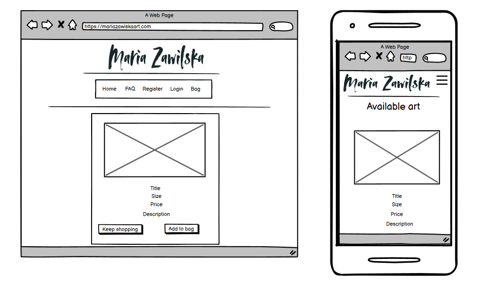
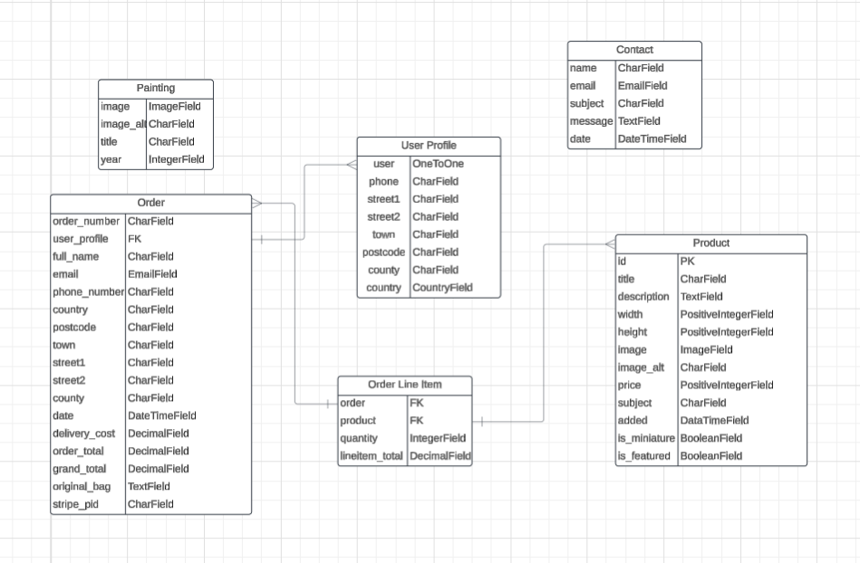
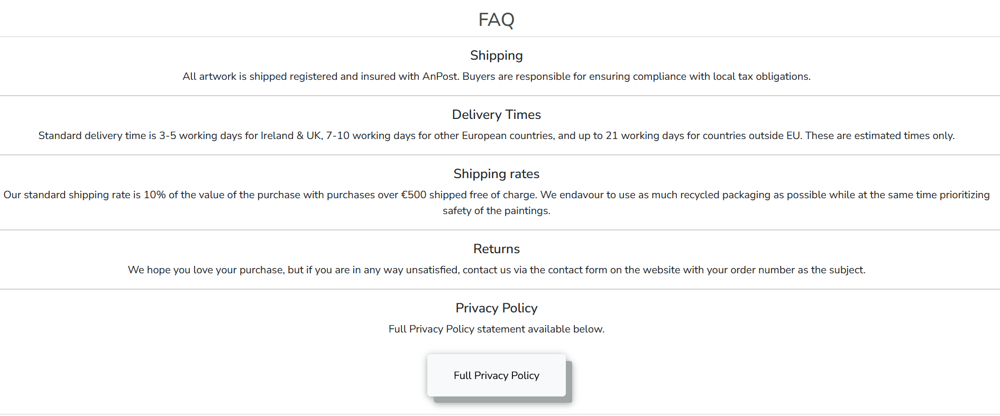
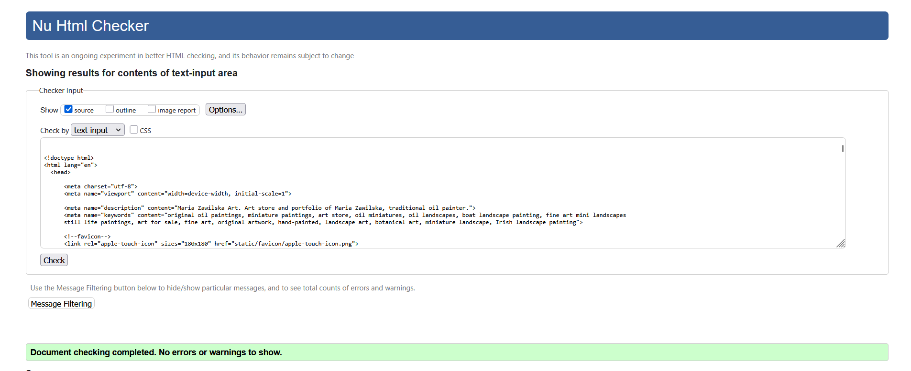
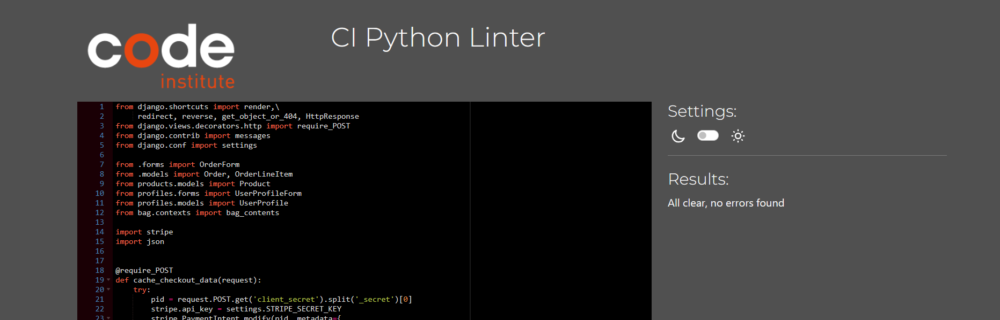
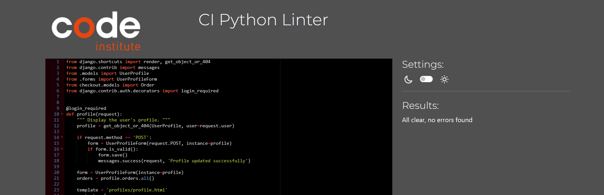

# Maria Zawilska Art

Maria Zawilska Art is a portfolio of a contemporary artist Maria Zawilska as well as the e-commerce website where Maria can sell her original artworks. 
  

[Click Here To Visit Live Site](https://maria-zawilska-art-68e0986b160e.herokuapp.com/)
[Github project board](https://github.com/users/codebyMai/projects/5/views/1)

## Table Of Contents:
1. [Design & Planning](#design-&-planning)
    * [Business model](#business-model)
    * [Marketing strategies](#user-stories)
    * [SEO](#seo)
    * [User Stories](#user-stories)
    * [Wireframes](#wireframes)
    * [Database Diagram](#database-diagram)
    * [Agile Methodology](#agile-methodology)
    * [Logo](#logo)
    * [Color Scheme](#color-scheme)
   
2. [Features](#features)
3. [Future features](#future-features)
4. [Technologies Used](#technologies-used)
5. [Testing](#testing)
6. [Bugs](#bugs)
7. [Deployment](#deployment)
8. [Credits](#credits)
9. [Acknowledgments](#acknowledgments)

# Design & Planning:
Design and planning took into account Maria's 30 years of experience in the fine art world as well as my own research.
The website design is purposefully minimal to allow the visitors to fully focus on the artwork.
Fine art world tends to favour art over matter and look unfavourably upon the artists who are deemed to be focused solely on sales. 
Keeping this in mind I have designed a separate landing page serving as a portfolio and only after choosing to enter the shop tab 
will the user be led to the ecommerce part of the website. To maintain cohesion they are identical in styling yet posses different navbars.
As selling fine art is an artform in itself I have focused on avoiding the overly commercialized look to the store letting the artwork speak for itself. 
Artworks sold are unique originals and only a limited number of artworks will be available for purchase at any given time.
Maria Zawilska Art website serves double purpose:
- as a portfolio:
   * allowing Maria to keep presence in the world of contemporary fine art;
   * introducing new potential collectors to Maria's work;
   * as a point of contact for potential galleries and exhibition opportunities;
- as a store:
   * allowing Maria to sell her original works;
   * with potential expansion in the future into the limited fine art prints and commissions;
   * allowing customers to subscribe to the mailing list to receive updates on new works being available in the store;


### Business model
We are focusing on showcasing and selling original artworks directly to customers, bypassing traditional galleries or middlemen. The artist can generate revenue through the sale of individual paintings, offer limited edition prints for a lower price point, and potentially create custom commissions, while leveraging the website for marketing, brand building, and creating a direct connection with their audience. Offering secure online payment options and integrating shipping services streamlines the buying process.

As only original artworks are offered on the website at the moment, to emphasize the fine art nature of the product, just limited number of artworks is available for sale at any given time. This is intended to highlight the scarcity and exclusivity of the product. Subscribed customers will be informed of the upcoming restocks through the mailing campaign, creating anticipation.
  

### Marketing 
Currently the website caters to individual customers who wish to purchase original artworks of Maria Zawilska making it B2C focused.

Current marketing strategies:
- utilising social media by regularly posting engaging content and interacting with followers, Maria aims to build an online presence and increase the brand awareness:

- customers are able to sign up to the mailing list to receive updates on new works being available in the store:
 

Future marketing strategies:
- in the future Maria intends to utilize:
   * Instagram - even though it is extremely saturated and not very helpful in creating fine art sales it is helpful in creating brand awareness;
   * Pinterest - underestimated but very effective tool to sell fine art;
   * usage of the Google and Facebook ads;

### SEO
- I have used wordtracker.com to identify short tail and long tail keywords.
- The short-tail keywords include terms such as "art store, art for sale, fine art, original artwork, hand-painted, art for sale, miniature landscape," while the long-tail keywords are more specific and include phrases like "original oil paintings, Irish landscape paintings, fine art mini landscapes".
- After carefully analyzing and generating comprehensive list of targeted keywords I have placed these strategically throughout the website.

### User Stories

#### User
- As a site visitor, I want be able to register for an account so that I can get more access to the website content, and to store my profile information 
- As a site visitor, I want to be able to view a list of the products so that I can select some to purchase 
- As a site visitor, I want to be able to view my shopping bag, so I that can confirm my choices or remove items 
- As a site visitor, I want to be able to view details of the products so that I can learn more about a specific painting 
- As a site visitor, I want to be able to pay for selected products so that I can complete my purchase
- As a site visitor, I want to be able to subscribe to a newsletter so that I can receive promotions and information about new products 
- As a site visitor, I want to be able to contact the site owner so that I can get answers to any enquires that I may have about the products or website 


#### Registered user
- As a registered user, I want to be able to reset my password so that I can recover access to my account in case I forget my password
- As a registered user, I want to be able to update my profile and delivery information
- As a registered user, I want to be able to view my order history on the profile page so that I can have better insight of my previous purchases
- As a registered user, I want to be able to change my password

#### Site owner
- As a site owner I want to be able to add, update and delete products directly from the website so I don't have to access admin panel

### Wireframes
Below are the wireframes for the site created using balsamiq:

<details><summary>Home Page</summary>

</details>

<details><summary>Shop</summary>

</details>

<details><summary>Products </summary>

</details>

<details><summary>Products Detail</summary>

</details>

### Database 


### Agile Methodology
I have created Kanban board to manage and visualize the workflow.
[Github project board](https://github.com/users/codebyMai/projects/5/views/1)

Project board was divided into 3 sections:
- To-Do- (all user stories were initially entered in the 'To Do' column)
- In Progress- (then during the development phase and implementing functionality stories were moved into the 'In Progress' column)
- Done- (and then finally they get moved into 'Done' once the development completes and functionality is implemented to cover that user story)

### Logo
I have designed the logo in [Canva](https://www.canva.com/) giving it a painterly effect to reflect the nature of the website.

### Colour scheme
Colour scheme is intentionally neutral and minimal to not to detract from the artwork.


# Features

### Navigation
There is two distinct sections of the website with their separate navigation menus:
<details><summary>Home</summary>

</details>

<details><summary>Shop</summary>

</details>

- on medium and small screens the navigation menu changes to the burger menu which shows all the nav links when clicked on
- superuser gets access to an additional tab displayed in the navigation menu: 'admin', which allows adding a product directly from the website without using the admin panel

### Home
Features large artwork and links to main parts of the website.
<details><summary>Home</summary>

</details>

### Shop
Introduces user to two distinct categories of Maria's artwork.
<details><summary>Shop</summary>

</details>

### Product page
Showcases available artworks including image, title and price.
- eye icon leads to detailed view of the artwork
<details><summary>Products</summary>

</details>

### Product detail page
Detailed view of the artwork including title, size, price and description as well as larger scale image.
<details><summary>Product detail</summary>

</details>

### Shopping bag page
Listing products added to the bag including image, title and price.
<details><summary>Bag</summary>

</details>

### Checkout page
<details><summary>Checkout</summary>

</details>

### Order confirmation
<details><summary>Confirmation</summary>

</details>

### Footer
Contains social media links, contact and subscription link.
<details><summary>Footer</summary>

</details>

### Admin
<details><summary>Admin</summary>

</details>

### FAQ
<details><summary>FAQ</summary>

</details>

### Contact page
<details><summary>Contact</summary>

</details>

### About
Introduces user to the artist.
<details><summary>About</summary>

</details>

### Gallery
<details><summary>Gallery</summary>

</details>


# Future features
- ability to sort products by size, miniatures vs. larger artworks;
- changing featured artworks by ticking 'is_featured' option;
- sold artwork images labeled sold so the store does not appear empty until next restock and 
- 


# Technologies used
- [HTML](https://en.wikipedia.org/wiki/HTML) 
- [CSS](https://en.wikipedia.org/wiki/CSS)  
- [Django](https://www.djangoproject.com/) 
- [Python](https://en.wikipedia.org/wiki/Python_(programming_language)), 
- [Bootstrap](https://en.wikipedia.org/wiki/Bootstrap)
- [JavaScript](https://en.wikipedia.org/wiki/JavaScript)
- [Gitpod](https://www.gitpod.io/about) 
- [Heroku](https://en.wikipedia.org/wiki/Heroku)
- [Github](https://en.wikipedia.org/wiki/GitHub) 
- [Git](https://en.wikipedia.org/wiki/Git)
- [Balsamiq](https://en.wikipedia.org/wiki/Balsamiq) 
- [LucidChart](https://www.lucidchart.com/pages/)
- [PostgreSQL](https://www.postgresql.org/) 
- [w3c Markup Validator](https://validator.w3.org) 
- [Am I Responsive?](http://ami.responsivedesign.is) 
- [PEP8 CI Python Linter](https://pep8ci.herokuapp.com/)
- [JSHint](https://jshint.com/) 
- [Jigsaw CSS validator](https://jigsaw.w3.org/css-validator/) 


# Testing

## Browser Compatibility
|  Browser | Links  | Pages  | Responsiveness  | Form fields  |
| ------------ | ------------ | ------------ | ------------ | ------------ |
| Mozilla  | Works as expected| Loading pages no issue  |  Responsiveness works as expected |  Works as expected |
|  Chrome | Works as expected  |  Loading pages no issue | Responsiveness works as expected  | Works as expected  |
|  Edge |  Works as expected | Loading pages no issue  | Responsiveness works as expected  |  Works as expected |

## Code validation

### HTML
The W3C Markup Validation Service
 
<details><summary>Home</summary>

</details>
<details><summary>About</summary>

</details>
<details><summary>Gallery</summary>

</details>
<details><summary>Shop</summary>

</details>
<details><summary>Products</summary>

</details>
<details><summary>Detail</summary>

</details>
<details><summary>FAQ</summary>

</details>
<details><summary>Checkout</summary>

</details>

### CSS
Jigsaw CSS validator 

<details><summary>General CSS</summary>

</details>
<details><summary>Profile CSS</summary>

</details>
<details><summary>Checkout CSS</summary>

</details>

### JS
JS Hint

<details><summary>Checkout</summary>

</details>

## Python
PEP8 CI Python Linter 

<details><summary>Gallery model</summary>

</details>
<details><summary>Gallery model</summary>

</details>
<details><summary>Checkout views</summary>

</details>
<details><summary>Contact views</summary>

</details>
<details><summary>Home views</summary>

</details>
<details><summary>Product model</summary>

</details>
<details><summary>Product form</summary>

</details>
<details><summary>Profile model</summary>

</details>
<details><summary>Profile views</summary>

</details>
<details><summary>Context</summary>

</details>

## Testing purchase 

## Testing purchase procedure
Action |  Expected result | Pass
--- | --- | :---:
Pick product, click on eye icon |  Chosen product appears with detailed description | &check;
Click 'add to bag' |  Product is added to shopping bag, success message is shown to the user | &check;
Click on the 'basket' icon in the navigation menu |  Redirected to shopping bag template | &check;
To remove productfrom basket, click bin icon |  Product is removed from shopping bag| &check;
Click 'secure checkout'|  Redirected to checkout page | &check;
Fill in all the details |  No errors displayed on the form | &check;
In payment section input 42 and repeat all the way to the end & click complete order | Payment went through, preview of purchase is displayed | &check;

Check email |  Email comfirmation has been sent | &check;
<details><summary>Order comfirmation</summary>

</details>
<details><summary>Stripe</summary>

</details>
<details><summary>Email comformation</summary>

</details>

## Testing user stories

User Story |  Test | Pass
--- | --- | :---:
As a site visitor, I want be able to register to be able to track my purchases | Register button in the navigation menu allows user to create an account| &check;
<details><summary>Navbar</summary>

User Story |  Test | Pass
--- | --- | :---:
As a site visitor, I want to be able to view the available artworks| From store website user can view all the artworks available at the time |&check;

User Story |  Test | Pass
--- | --- | :---:
As a site visitor, I want to be able to find out more info about particular artwork| By clicking on the image of the product, user is redirected to the separate page which shows the title, dimensions, price and description of the artwork| &check;

 User Story |  Test | Pass
--- | --- | :---:
 As a site visitor I want to be able to view my shopping bag and remove unwanted artworks | User can access shopping bag by clicking on the icon in the navigation menu, new page is displayed to the user with products in the bag and option to remove them| &check;

 User Story |  Test | Pass
--- | --- | :---:
As a site visitor I want to be able to pay for the selected artworks| By clicking 'secure checkout' button in the shopping bag, user is redirected to the checkout page, where they can once again see selected artworks and complete the purchase |&check;

User Story |  Test | Pass
--- | --- | :---:
As a site visitor, I want to be able to get confirmation for my previous order | After completing the purchase order history is visible to the user on their profile page |&check;

User Story |  Test | Pass
--- | --- | :---:
As a site visitor, I want to be able to subscribe to newsletter so that I can receive info about new art available for purchase | On the bottom of the website there is an input field for subscription to the newsletter |&check;

User Story |  Test | Pass
--- | --- | :---:
 As a site visitor, I want to be able to contact the site owner | Envelope icon in the footer leads to contact form where any queries can be submitted|&check;

 User Story |  Test | Pass
--- | --- | :---:
 As a registered user, I want to be able to reset my password so that I can recover access to my account | By clicking on the login button, user can click on 'forgot password' link which allows user to reset their password|&check;

 User Story |  Test | Pass
--- | --- | :---:
As a registered user, I want to be able to update my profile and delivery information |Clicking on the 'My Profile; user is redirected to the profile page, where they can update their delivery/personal information|&check;

User Story |  Test | Pass
--- | --- | :---:
As a site owner I want to be able to add, update and delete products directly from the website without the use of admin panel | After logging in as superuser admin link in navigation menu appears as well as option of editing and deleting products directly on product page|&check;


# Bugs
## Remaining bugs
- Shopping bag validation throws errors in relation to stray and unclosed <form> and <td> elements which I investigated but failed to find a solution for within allocated time frame.
<details><summary>Bag</summary>

</details>
- Artworks are still visible after purchase and can be added to the bag by another customer - to amend this a future iteration will introduce a 'sold' label to sold artworks and quantity is going to be limited to one.
- MailChimp logo placement on smaller devices is not ideal.
- Despite many attempts I didn't manage to figure out what causes failure of payment.intent.succedded and confirmation emails. Out of the 4 events one continuously fails while three remaining succeed:
<details><summary>Stripe</summary>

</details>
- Attempts to fix error of hidden labels in the checkout, which HTML validation revealed, resulted in 2 unwanted visible input boxes appearing under the form. Time constraints prevented me from investigating the issue further. 

# Deployment
###Heroku

### Stripe
- Sign in or create an account with [Stripe](https://stripe.com/gb)
- Click "Developers" from the menu on the left hand side and then "API keys"
- Copy the "Publishable key" and "Secret key"
- Add these to Heroku Config Vars as STRIPE_PUBLIC_KEY and STRIPE_SECRET_KEY respectively.
- Click "Webhooks" from the Developers tab and then "+ Add endpoint"
- Enter the following as the "Endpoint URL":
```
https://'your-website-name'.herokuapp.com/checkout/wh/
```
- Select "Recieve all events" and then "Add endpoint"
- Copy the "Signing secret"
- Add the "Signing secret" to Heroku Config Vars as STRIPE_WH_SECRET

### Steps to clone project
- Click on the code tab under the repository name.
- Then click on "Code" button to the right above the files listed.
- Click on the clipboard icon to copy the URL.
- Open Git Bash in your preferred IDE.
- Change the working directory to where you want your cloned directory.
- Type git clone and then paste the URL that you copied.
- Press enter and clone is complete.
- In the terminal install the requirements by using the following: pip install -r requirements.txt
- Next create the env.py file containing variables to use.
- Add env.py to a .gitignore to prevent it from being pushed to Github
- Make migrations by running : python manage.py makemigrations
- Migrate those changes with python manage.py migrate
- To run the project type python manage.py runserver into the terminal.
- This will open the project locally for you to work on.

### Forking repository on GitHub
- Login to Github and find the repository
- You will find the fork button on the right hand side
- Click on the fork button to copy the repository.

# Credits
- Maria Zawilska for the opportunity to work with her amazing art
- All the photos used were taken by me with the exception of two images of art materials which came from [Pixabay](https://pixabay.com/)
- Product descriptions were written by me with some help from [ChatGPT](https://chatgpt.com/)
- [Code institute](https://codeinstitute.net) Boutique Ado walkthrough informed core for my website
- [Stackoverflow](https://stackoverflow.com) for inspiration and solutions to many problems, among them django-countries issue with Django 5.1.4 and Bootstrap5 issue with crispy forms 
- [@CloudWithDjango](https://www.youtube.com/watch?v=fQo9ivqX4xs) - very clear and concise instructions on how to host uploaded images and static files on Cloudinary
- The image conversions from png to webp were done with [Picflow](https://picflow.com)
- @Richard Ash for publishing on Slack his custom solution to uncooperative toast messages in Bootstrap5
- https://www.contemporaryartissue.com/how-to-create-a-professional-artist-website/ https://artprof.org/pro-development/how-to-create-an-artist-website/
- youtube channels [@Codemycom](https://www.youtube.com/@Codemycom), [@DennisIvy](https://www.youtube.com/@DennisIvy)helped me to get a better understanding of Django

# Acknowledgments
- I would like to thank my mentor, cohort facilitator and Code Institute. 
[Back to the top](# Maria Zawilska Art)
